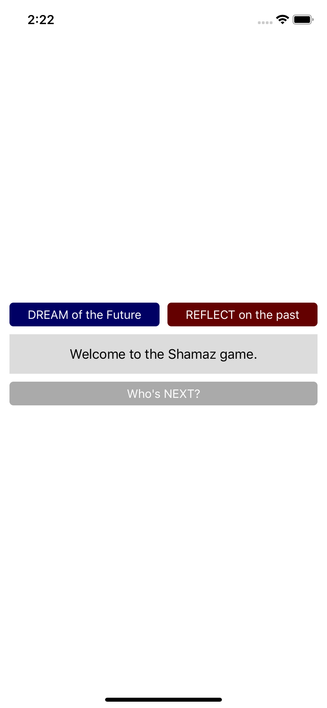
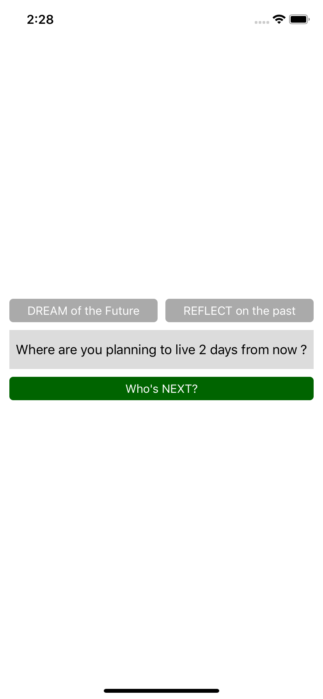
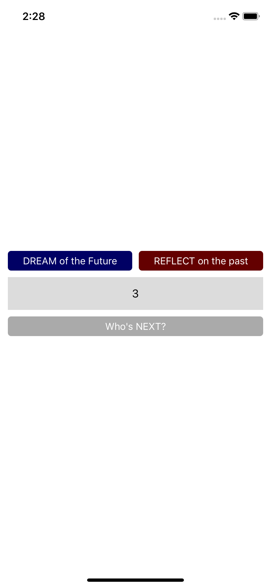
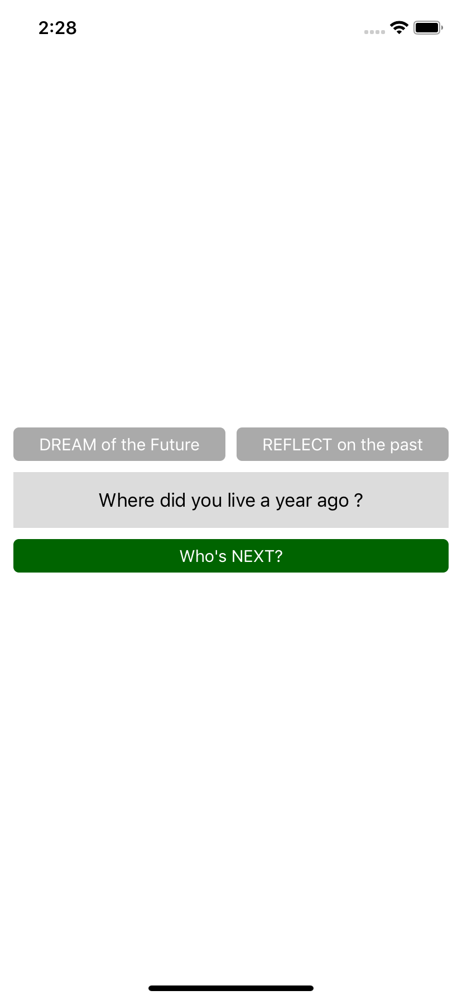

#  OpenClassrooms - iOS developer path - iOS Project 3
## Shazam - Portrait (iPhone and iPad)

This is a <b><i>really simple</i></b> question application played by 10 people to get to know each other.
Each player is identified by a number from 1 to 10. 

The first player starts the game by choossing if he/she wants to answer a random question concerning his/her past or future.

 

When the user taps on the "DREAM from the future" button, the application will show a random question concerning his/her future.
The time/duration is generated randomly (day, month or year).  

 

After answering the question to the other players, the user will taps on "Who's NEXt?" button.
The app will randomly show a number from 1 to 10. The corresponding player will take the phone. 

 

When the user taps on the "REFLECT on the past" button, the application will show a random question concerning his/her past.
The time/duration is generated randomly (day, month or year).  

 
